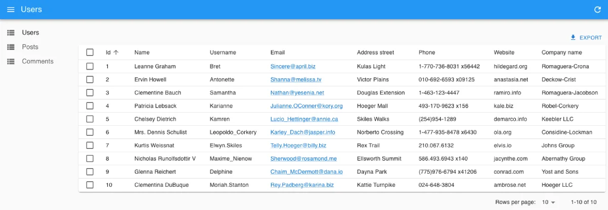

# Create-React-App Integration

[Create-React-App](https://create-react-app.dev/) is a convenient way to bootstrap single-page React applications. It provides a pre-configured build setup with no configuration.

## Setting Up Create React App

Create a new Create React App (CRA) project with the command line:

```sh
yarn create react-app my-admin
```

We recommend using the TypeScript template:

```sh
yarn create react-app my-admin --template typescript
```

## Setting Up React-Admin

Add the `react-admin` package, as well as a data provider package. In this example, we'll use `ra-data-json-server` to connect to a test API provided by [JSONPlaceholder](https://jsonplaceholder.typicode.com).

```sh
cd my-admin
yarn add react-admin ra-data-json-server
```

Next, create the admin app component in `src/admin/index.tsx`:

```jsx
// in src/admin/index.tsx
import { Admin, Resource, ListGuesser } from "react-admin";
import jsonServerProvider from "ra-data-json-server";

const dataProvider = jsonServerProvider("https://jsonplaceholder.typicode.com");

const App = () => (
  <Admin dataProvider={dataProvider}>
    <Resource name="posts" list={ListGuesser} />
    <Resource name="comments" list={ListGuesser} />
  </Admin>
);

export default App;
```

This is a minimal admin for 2 resources. React-admin should be able to render a list of posts and a list of comments, guessing the data structure from the API response. 

Next, replace the `App.tsx` component with the following:

```jsx
import MyAdmin from "./admin";

const App = () => <MyAdmin />;

export default App;
```

Now, start the server with `yarn start`, browse to `http://localhost:3000/`, and you should see the working admin:



Your app is now up and running, you can start tweaking it. 

## Ensuring Users Have The Latest Version

If your users might keep the application open for a long time, it's a good idea to add the [`<CheckForApplicationUpdate>`](./CheckForApplicationUpdate.md) component. It will check whether a more recent version of your application is available and prompt users to reload their browser tab.

To determine whether your application has been updated, it fetches the current page at a regular interval, builds a hash of the response content (usually the HTML) and compares it with the previous hash.

To enable it, start by creating a custom layout:

```tsx
// in src/admin/MyLayout.tsx
import { CheckForApplicationUpdate, Layout, LayoutProps } from 'react-admin';

export const MyLayout = ({ children, ...props }: LayoutProps) => (
    <Layout {...props}>
        {children}
        <CheckForApplicationUpdate />
    </Layout>
);
```

Then use this layout in your app:

```diff
import { Admin, Resource, ListGuesser } from "react-admin";
import jsonServerProvider from "ra-data-json-server";
+import { MyLayout } from './MyLayout';

const dataProvider = jsonServerProvider("https://jsonplaceholder.typicode.com");

const App = () => (
-  <Admin dataProvider={dataProvider}>
+  <Admin dataProvider={dataProvider} layout={MyLayout}>
    <Resource name="posts" list={ListGuesser} />
    <Resource name="comments" list={ListGuesser} />
  </Admin>
);

export default App;
```
