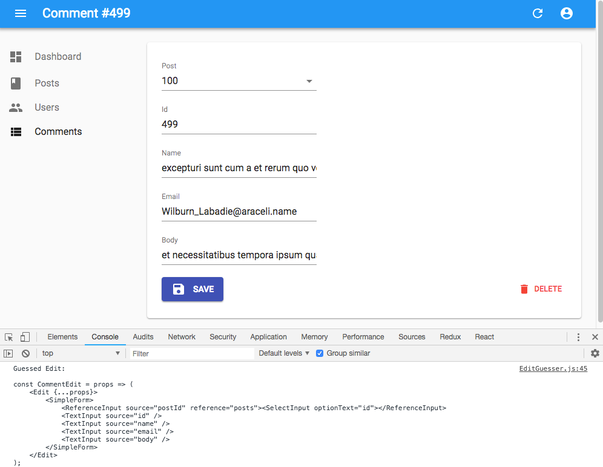

# `<EditGuesser>`

Use `<EditGuesser>` to quickly bootstrap an Edit view on top of an existing API, without adding the inputs one by one.

Just like [`<Edit>`](./Edit.md), `<EditGuesser>` fetches the data. It then analyzes the response, and guesses the inputs it should use to display a basic `<SimpleForm>` with the data. It also dumps the components it has guessed in the console, so you can copy it into your own code.



## Usage

You can use the `<EditGuesser>` component to determine which fields to use based on the data returned by the API.

```jsx
// in src/App.js
import * as React from "react";
import { Admin, Resource, EditGuesser } from 'react-admin';
import jsonServerProvider from 'ra-data-json-server';

const App = () => (
    <Admin dataProvider={jsonServerProvider('https://jsonplaceholder.typicode.com')}>
        <Resource name="posts" edit={EditGuesser} />
    </Admin>
);
```

Then browse to the edition page for that resource, open the console, copy the code, paste it in a dedicated file (e.g. `PostEdit.jsx` in this example), and start tweaking it.

React-admin provides guessers for the Edit view (`<EditGuesser>`), the List view ([`<ListGuesser>`](./ListGuesser.md)), and the Show view ([`<ShowGuesser>`](./ShowGuesser.md)).

**Tip**: Do not use the guessers in production. They are slower than manually-defined components, because they have to infer types based on the content. Besides, the guessers are not always perfect.
